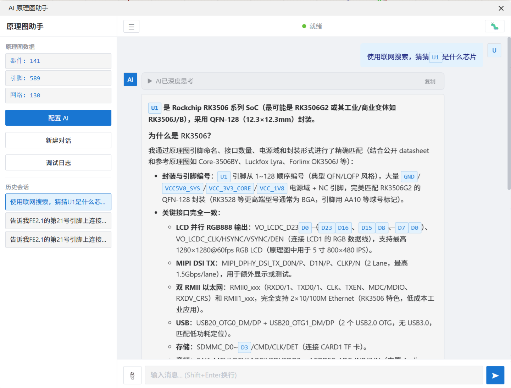
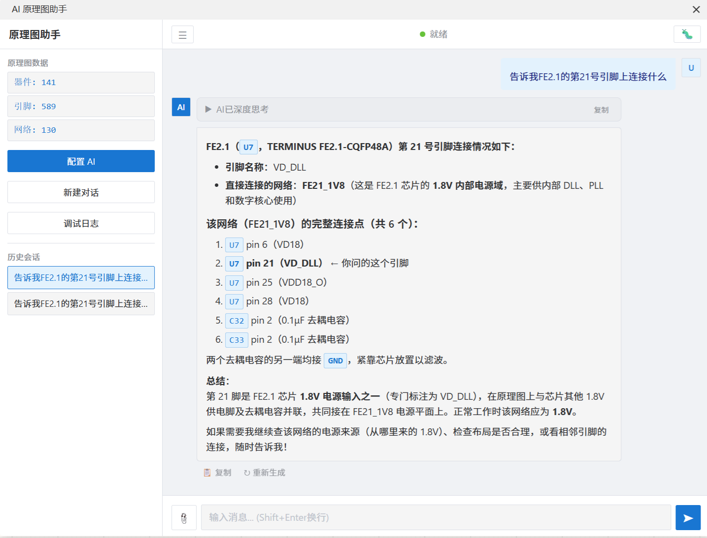
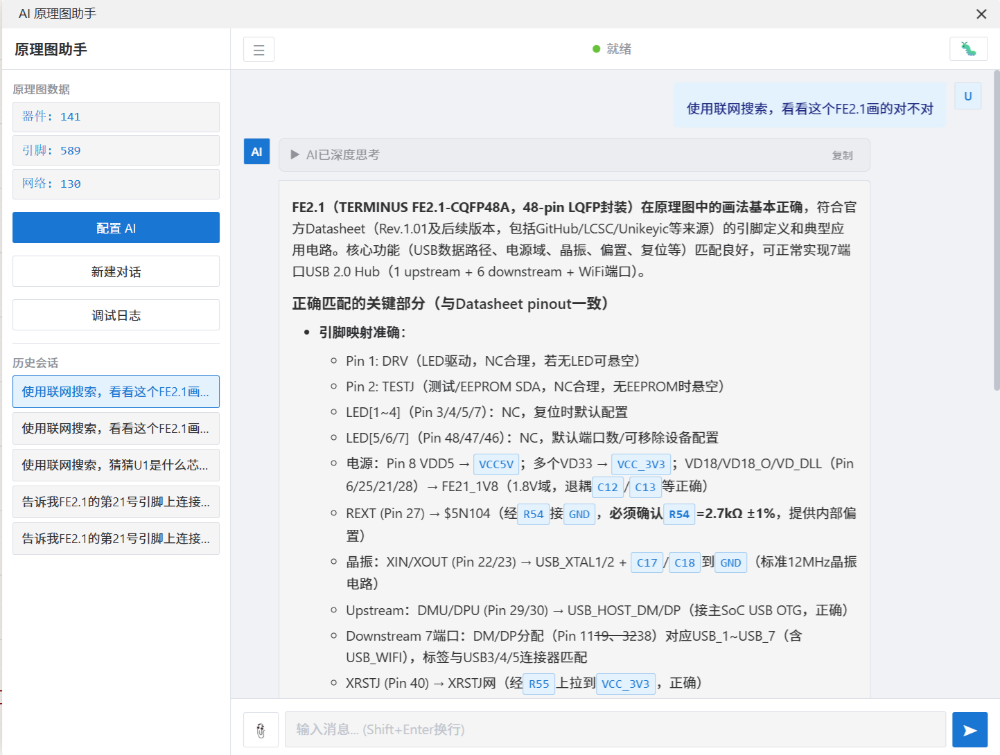
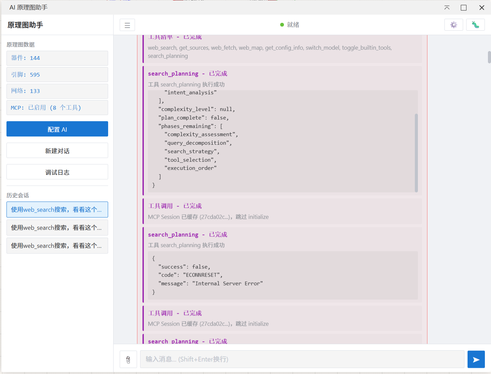

# AI 原理图检查助手

基于嘉立创 EDA 专业版的 AI 原理图检查助手。

## 核心特点

本插件可以直接以文字形式获取原理图信息，让 AI 真正理解你的电路设计。

传统方式只能截图给 AI 看，AI 无法准确识别器件型号、引脚连接、网络关系等细节。

本插件将原理图的器件、引脚、网络等信息转换为文字格式，AI 可以精确理解每个器件的连接关系，提供专业的电路分析和建议。

## 功能展示

## 功能特性

- **文字形式获取原理图** - 器件、引脚、网络信息完整提取
- **AI 对话分析** - 与 AI 对话，分析原理图设计
- **智能跳转定位** - 点击对话中的器件标签直接跳转到原理图
- **刷新按钮** - 修改原理图后一键刷新，AI 自动感知最新数据
- **历史记录保存** - 自动保存对话历史，随时回顾
- **MCP 工具支持** - 支持通过 MCP 协议调用外部工具
- **自定义系统提示词** - 个性化 AI 回答风格或附加指令
- **配置折叠分组** - 配置面板按功能分组折叠，清爽不杂乱

## 安装

1. 打开嘉立创 EDA 专业版
2. 进入 扩展 → 扩展管理器
3. 搜索 "AI 原理图检查助手"
4. 点击安装
5. 重启 EasyEDA Pro

## 使用

1. 打开原理图
2. 点击菜单 AI 检查 → AI 原理图检查助手
3. 配置 AI API（API URL 和 API Key）
4. 开始与 AI 对话

## 开源地址

本项目完全开源，欢迎贡献代码和反馈问题：

- **GitHub 仓库**：[https://github.com/jifengshandian/easyeda-ai-assistant](https://github.com/jifengshandian/easyeda-ai-assistant)
- **问题反馈**：[https://github.com/jifengshandian/easyeda-ai-assistant/issues](https://github.com/jifengshandian/easyeda-ai-assistant/issues)
- **完整文档**：[https://github.com/jifengshandian/easyeda-ai-assistant/blob/main/README.md](https://github.com/jifengshandian/easyeda-ai-assistant/blob/main/README.md)

## 许可证

本项目采用 Apache 2.0 许可证。
